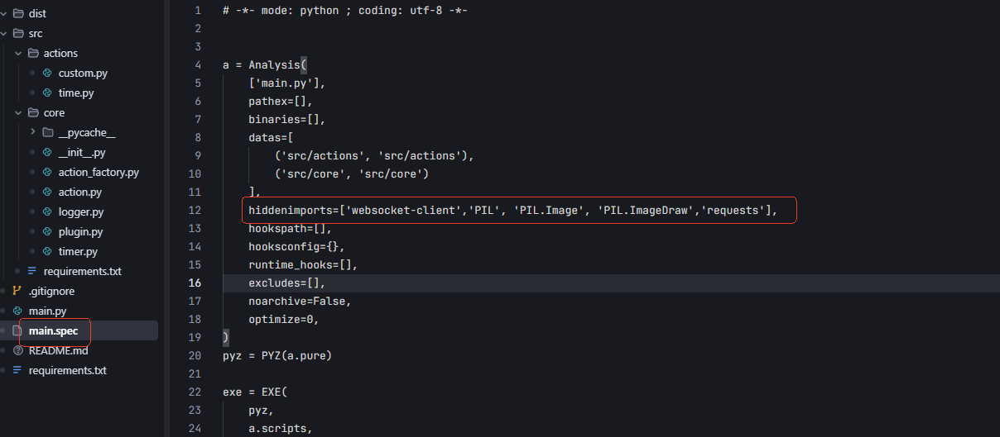

# Drohack's Tools for StreamDock

This is buit on top of the example plugin here: https://github.com/MiraboxSpace/StreamDock-Plugin-SDK/tree/main/SDPythonSDK
It has these tools working in Windows:

- **Volume**: Button or Knob, shows the current Windows master volume via background fill & number. Press mutes; knob rotation changes volume by 5.
- **Game Volume**: Knob or Button that controls every app EXCEPT an exclude list (Discord by default), so game/media volume is independent of voice chat. It never touches Windows master. Absolute mode — all non-excluded apps track the knob and newly launched apps conform. All Game Volume keys share one level (edit the exclude list in the property inspector). Press mutes those apps. Discord is special-cased: only its voice audio is excluded — Discord's other sounds (chat videos, pings, UI beeps) play through a separate audio session and follow the knob (and mute) like any other app, while voice stays owned by the Discord Voice knob.
- **Discord Voice**: Knob for Discord's voice output volume (0–200, Discord's native range; 100 = normal, above = boost). Press to deafen. Uses Discord's local RPC so it works whenever Discord is running — no audio session needed — and stays in sync with changes made in Discord itself.
- **Discord Mute**: Button that mutes/unmutes your mic; if you're deafened, one press undeafens and unmutes. Shows the live/muted/deafened icon plus the current voice volume.
- **Gif**: Plays gifs on a button, gifs put in the /static/gifs/ folder, resizes them to 72x72. Can play Random, Shuffle (plays though all randomly without repeats), in Order (all 3 rotate every 30 seconds), or a Static gif where you choose one to play on loop.

### Discord setup (one time, for the Discord Voice / Mute actions)

1. Go to https://discord.com/developers/applications and create a **New Application** (you can ignore the "verification" section — that's only for public apps in 100+ servers; local RPC works for your own account on an unverified app).
2. On the **OAuth2** page, copy the **Client ID** and **Client Secret**, and add a redirect URL of `http://localhost`.
3. In StreamDock, open a Discord Voice or Discord Mute key's settings, paste the Client ID + Secret, click **Save + Connect**, and approve the popup that appears inside Discord.

Tokens are stored in the plugin's global settings and refresh automatically. Discord only allows one app to control voice settings at a time, so avoid using another Discord plugin's mute/deafen actions simultaneously.

## Features

- WebSocket Communication: Provides real-time communication with Stream Dock software
- Event Handling: Supports handling of button clicks, setting changes, and other events
- Timer: Supports setting up timed tasks and periodic tasks
- Logging System: Integrated logging functionality for debugging and troubleshooting

## Project Structure

```
.
├── src/                # Source code directory
│   ├── core/          # Core functionality modules
│   │   ├── action.py        # Action class, handles button events
│   │   ├── plugin.py        # Core plugin class, manages WebSocket connections
│   │   ├── timer.py         # Timer functionality
│   │   ├── logger.py        # Log management
│   │   └── action_factory.py # Action factory class
│   └── actions/       # Specific action implementations
├── requirements.txt   # Project dependencies
├── main.py           # Main program entry
├── main.spec         # PyInstaller configuration file
└── README.md         # Project documentation
```

## Development Environment Setup

1. Create virtual environment:
```bash
python -m venv venv
```

2. Activate virtual environment:
- Windows:
```bash
venv\Scripts\activate
```
- Unix/MacOS:
```bash
source venv/bin/activate
```

3. Install dependencies:
```bash
pip install -r requirements.txt
```

## Plugin Development Guide

### Creating Custom Actions

1. Create a new action class in the `src/actions` directory:

```python
from src.core.action import Action

class Custom(Action):
    def __init__(self, action, context, settings, plugin):
        super().__init__(action, context, settings, plugin)
    
    def on_key_up(self, payload):
        # Handle button click event
        self.set_title("Button Clicked")
        self.set_state(0)
```

2. Using the timer functionality:

```python
def update_display(self):
    # Update display content
    current_time = time.strftime("%H:%M:%S")
    self.set_title(current_time)

# Set timer with 1-second interval
self.plugin.timer.set_interval(self.context, 1000, self.update_display)
```

### Logging

```python
from src.core.logger import Logger

# Log information
Logger.info("Operation successful")
# Log error
Logger.error("Error occurred")
```

## Packaging and Distribution

Use PyInstaller to package into an executable file:

```bash
pyinstaller main.spec
```

The packaged file will be generated in the `dist` directory.

## Installing to StreamDock

1. Copy the built `DrohackPlugin.exe` from the `dist` directory into the plugin bundle folder:

```
com.drohack.streamdock.tools.sdPlugin/
├── DrohackPlugin.exe       <-- copy here
├── manifest.json
├── propertyInspector/
└── static/
```

2. Copy the entire `com.drohack.streamdock.tools.sdPlugin` folder to the StreamDock plugins directory:

```
%APPDATA%\HotSpot\StreamDock\plugins\
```

3. Restart the StreamDock application. Your plugin ("Drohack's Tools") should appear in the action list.

## Note

If you encounter module not found errors, this is because `action_factory.py` uses `importlib.import_module` to dynamically load classes under `actions`, and `PyInstaller` statically analyzes code during packaging. PyInstaller will consider modules only used in `action` as unused and won't package them into the exe. We can directly add the relevant modules to `hiddenimports` manually to resolve this.



## Development Standards

- Use type annotations to ensure code type safety
- Follow PEP 8 coding standards
- Write unit tests to ensure code quality
- Use the built-in logging system to record critical information

## License

This project is licensed under the MIT License. See the LICENSE file for details.
